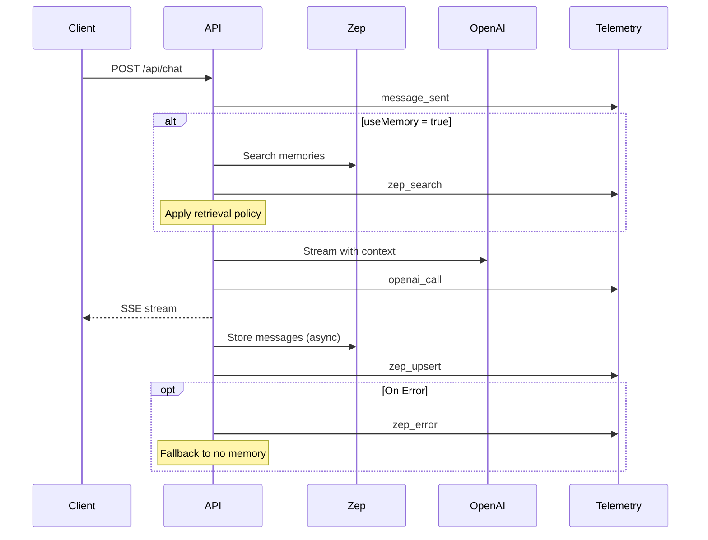

# Zep Telemetry Events Specification

## Overview

This document defines the telemetry events emitted by the Zep adapter. These events track performance, usage, and errors for memory operations, enabling monitoring and optimization of the Zep integration.

## Event Types

### 1. `zep_search`

**Purpose**: Track memory search operations and retrieval performance.

**When Emitted**: 
- Before OpenAI call when `useMemory=true`
- During session message retrieval
- During knowledge graph queries

**Event Structure**:

```typescript
interface ZepSearchEvent {
  // Standard fields
  type: 'zep_search';
  user_id: string;
  session_id: string;
  req_id: string;
  created_at: string;  // ISO 8601
  
  // Payload
  payload_json: {
    // Timing
    zep_ms: number;                    // Total Zep operation time
    
    // Operation details
    operation: 'memory_search' | 'session_history' | 'knowledge_query';
    collection_name: string;            // e.g., "user:123"
    query?: string;                     // Search query (truncated to 200 chars)
    
    // Results
    results_count: number;              // Number of results returned
    total_results?: number;             // Total before filtering
    
    // Configuration
    top_k: number;                      // Requested top K
    clip_sentences: number;             // Sentence clipping config
    memory_token_budget: number;        // Token budget limit
    search_type?: 'hybrid' | 'semantic' | 'keyword';
    min_score?: number;                 // Minimum relevance threshold
    
    // Processing
    dedup_count?: number;               // Duplicates removed
    clipped_count?: number;             // Results clipped
    tokens_used?: number;               // Estimated tokens in results
    
    // Cache
    cache_hit?: boolean;                // Whether served from cache
    cache_key?: string;                 // Cache key hash
    
    // Session-specific (for session_history)
    limit?: number;                     // Page size
    cursor?: string;                    // Pagination cursor
    has_more?: boolean;                 // More results available
  };
}
```

**Example Event**:

```json
{
  "type": "zep_search",
  "user_id": "a0eebc99-9c0b-4ef8-bb6d-6bb9bd380a11",
  "session_id": "session-20250119-100000-x7y2",
  "req_id": "req-abc123",
  "created_at": "2025-01-19T10:00:01.234Z",
  "payload_json": {
    "zep_ms": 145,
    "operation": "memory_search",
    "collection_name": "user:a0eebc99-9c0b-4ef8-bb6d-6bb9bd380a11",
    "query": "authentication methods",
    "results_count": 8,
    "total_results": 15,
    "top_k": 8,
    "clip_sentences": 2,
    "memory_token_budget": 1500,
    "search_type": "hybrid",
    "min_score": 0.3,
    "dedup_count": 3,
    "clipped_count": 5,
    "tokens_used": 1247,
    "cache_hit": false
  }
}
```

### 2. `zep_upsert`

**Purpose**: Track data storage operations (messages, facts, collections).

**When Emitted**:
- After adding messages to a session
- After upserting knowledge graph edges
- When ensuring/creating user collections

**Event Structure**:

```typescript
interface ZepUpsertEvent {
  // Standard fields
  type: 'zep_upsert';
  user_id: string;
  session_id?: string;  // Optional for collection operations
  req_id: string;
  created_at: string;
  
  // Payload
  payload_json: {
    // Timing
    zep_ms: number;                    // Total operation time
    
    // Operation details
    operation: 'add_messages' | 'upsert_facts' | 'ensure_collection';
    collection_name: string;
    
    // Message-specific
    message_count?: number;             // Number of messages added
    batch_size?: number;                // Batch size used
    
    // Fact-specific
    edge_count?: number;                // Number of edges upserted
    new_edges?: number;                 // Newly created edges
    updated_edges?: number;             // Updated existing edges
    predicates?: string[];              // Unique predicates used
    
    // Collection-specific
    created?: boolean;                  // Whether collection was created
    
    // Results
    success_count?: number;             // Successfully processed items
    failed_count?: number;              // Failed items
    
    // Performance
    queued?: boolean;                   // Whether operation was queued
    retry?: boolean;                    // Whether this is a retry
    retry_attempt?: number;             // Retry attempt number
  };
}
```

**Example Event**:

```json
{
  "type": "zep_upsert",
  "user_id": "a0eebc99-9c0b-4ef8-bb6d-6bb9bd380a11",
  "session_id": "session-20250119-100000-x7y2",
  "req_id": "req-abc123",
  "created_at": "2025-01-19T10:00:02.456Z",
  "payload_json": {
    "zep_ms": 87,
    "operation": "add_messages",
    "collection_name": "user:a0eebc99-9c0b-4ef8-bb6d-6bb9bd380a11",
    "message_count": 2,
    "batch_size": 2,
    "success_count": 2,
    "failed_count": 0,
    "queued": false,
    "retry": false
  }
}
```

### 3. `zep_error`

**Purpose**: Track failures and errors in Zep operations.

**When Emitted**:
- On timeout (> 3000ms)
- On API errors (4xx, 5xx)
- On network failures
- On validation errors

**Event Structure**:

```typescript
interface ZepErrorEvent {
  // Standard fields
  type: 'zep_error';
  user_id?: string;      // May be unknown on early errors
  session_id?: string;
  req_id: string;
  created_at: string;
  
  // Payload
  payload_json: {
    // Timing
    zep_ms?: number;                   // Time before error (if measurable)
    
    // Operation context
    operation: string;                  // Operation that failed
    collection_name?: string;
    
    // Error details
    error_code: string;                 // Error code
    error_type: 'timeout' | 'api_error' | 'network' | 'validation' | 'unknown';
    http_status?: number;               // HTTP status code if applicable
    error_message?: string;             // Error message (sanitized)
    
    // Retry information
    will_retry?: boolean;               // Whether retry will be attempted
    retry_attempt?: number;             // Current retry attempt
    max_retries?: number;               // Maximum retry attempts
    
    // Impact
    fallback?: 'no_memory' | 'cache' | 'skip';  // Fallback strategy used
    degraded?: boolean;                 // Whether service is degraded
    
    // Request details (for debugging)
    request_size?: number;              // Request payload size
    endpoint?: string;                  // Zep endpoint called
  };
}
```

**Example Event**:

```json
{
  "type": "zep_error",
  "user_id": "a0eebc99-9c0b-4ef8-bb6d-6bb9bd380a11",
  "session_id": "session-20250119-100000-x7y2",
  "req_id": "req-abc123",
  "created_at": "2025-01-19T10:00:03.789Z",
  "payload_json": {
    "zep_ms": 3001,
    "operation": "memory_search",
    "collection_name": "user:a0eebc99-9c0b-4ef8-bb6d-6bb9bd380a11",
    "error_code": "TIMEOUT",
    "error_type": "timeout",
    "error_message": "Zep search timeout after 3000ms",
    "will_retry": false,
    "fallback": "no_memory",
    "degraded": false,
    "endpoint": "/collections/user:a0eebc99/search"
  }
}
```

## Event Ordering

The correct sequence of events in a chat request with memory:



**Critical Ordering Rule**: `zep_search` MUST occur before `openai_call` when memory is enabled.

## Implementation Examples

### Telemetry Service Integration

```typescript
// apps/api/src/services/telemetry.ts

export class TelemetryService {
  async recordZepSearch(
    userId: string,
    sessionId: string,
    reqId: string,
    details: {
      operation: 'memory_search' | 'session_history' | 'knowledge_query';
      collectionName: string;
      query?: string;
      config: RetrievalConfig;
      results: RetrievalPayload;
      timing: number;
      cacheHit?: boolean;
    }
  ): Promise<void> {
    const event: ZepSearchEvent = {
      type: 'zep_search',
      user_id: userId,
      session_id: sessionId,
      req_id: reqId,
      created_at: new Date().toISOString(),
      payload_json: {
        zep_ms: details.timing,
        operation: details.operation,
        collection_name: details.collectionName,
        query: details.query?.substring(0, 200),
        results_count: details.results.memories.length,
        total_results: details.results.metadata.totalResults,
        top_k: details.config.topK,
        clip_sentences: details.config.clipSentences,
        memory_token_budget: details.config.maxTokens,
        search_type: details.config.searchType,
        min_score: details.config.minScore,
        dedup_count: details.results.metadata.appliedFilters.includes('deduplication') 
          ? details.results.metadata.totalResults - details.results.memories.length 
          : 0,
        tokens_used: details.results.metadata.totalTokens,
        cache_hit: details.cacheHit || false
      }
    };
    
    await this.store(event);
  }
  
  async recordZepUpsert(
    userId: string,
    sessionId: string | undefined,
    reqId: string,
    details: {
      operation: 'add_messages' | 'upsert_facts' | 'ensure_collection';
      collectionName: string;
      timing: number;
      messageCount?: number;
      edgeCount?: number;
      created?: boolean;
      success: boolean;
      failedCount?: number;
    }
  ): Promise<void> {
    const event: ZepUpsertEvent = {
      type: 'zep_upsert',
      user_id: userId,
      session_id: sessionId,
      req_id: reqId,
      created_at: new Date().toISOString(),
      payload_json: {
        zep_ms: details.timing,
        operation: details.operation,
        collection_name: details.collectionName,
        message_count: details.messageCount,
        edge_count: details.edgeCount,
        created: details.created,
        success_count: details.success ? 
          (details.messageCount || details.edgeCount || 1) : 0,
        failed_count: details.failedCount || 0
      }
    };
    
    await this.store(event);
  }
  
  async recordZepError(
    reqId: string,
    details: {
      userId?: string;
      sessionId?: string;
      operation: string;
      collectionName?: string;
      error: any;
      timing?: number;
      willRetry?: boolean;
      fallback?: 'no_memory' | 'cache' | 'skip';
    }
  ): Promise<void> {
    const errorType = this.classifyError(details.error);
    
    const event: ZepErrorEvent = {
      type: 'zep_error',
      user_id: details.userId,
      session_id: details.sessionId,
      req_id: reqId,
      created_at: new Date().toISOString(),
      payload_json: {
        zep_ms: details.timing,
        operation: details.operation,
        collection_name: details.collectionName,
        error_code: details.error.code || 'UNKNOWN',
        error_type: errorType,
        http_status: details.error.status,
        error_message: this.sanitizeError(details.error.message),
        will_retry: details.willRetry || false,
        fallback: details.fallback
      }
    };
    
    await this.store(event);
  }
  
  private classifyError(error: any): string {
    if (error.code === 'ETIMEDOUT' || error.code === 'TIMEOUT') {
      return 'timeout';
    }
    if (error.status >= 400 && error.status < 500) {
      return 'api_error';
    }
    if (error.status >= 500) {
      return 'api_error';
    }
    if (error.code === 'ECONNREFUSED' || error.code === 'ENOTFOUND') {
      return 'network';
    }
    if (error.name === 'ValidationError') {
      return 'validation';
    }
    return 'unknown';
  }
  
  private sanitizeError(message?: string): string {
    if (!message) return 'Unknown error';
    
    // Remove sensitive data patterns
    return message
      .replace(/[a-zA-Z0-9_-]{20,}/g, '[REDACTED]')  // API keys
      .replace(/user:[a-f0-9-]{36}/g, 'user:[ID]')    // User IDs
      .substring(0, 500);                              // Truncate
  }
}
```

### Usage in Zep Adapter

```typescript
class ZepAdapter {
  async searchMemory(
    userId: string,
    query: string,
    config: RetrievalConfig
  ): Promise<RetrievalPayload> {
    const startTime = Date.now();
    const reqId = this.getRequestId();
    const collectionName = `user:${userId}`;
    
    try {
      // Check cache first
      const cacheKey = this.getCacheKey(userId, query, config);
      const cached = this.cache.get(cacheKey);
      
      if (cached) {
        // Record cache hit
        await this.telemetry.recordZepSearch(
          userId,
          this.sessionId,
          reqId,
          {
            operation: 'memory_search',
            collectionName,
            query,
            config,
            results: cached,
            timing: 0,
            cacheHit: true
          }
        );
        return cached;
      }
      
      // Perform search
      const rawResults = await this.client.search({
        collection: collectionName,
        query,
        limit: config.topK * 2
      });
      
      // Apply retrieval policy
      const processed = await applyRetrievalPolicy(rawResults, config);
      
      // Cache results
      this.cache.set(cacheKey, processed, 60); // 60s TTL
      
      // Record telemetry
      await this.telemetry.recordZepSearch(
        userId,
        this.sessionId,
        reqId,
        {
          operation: 'memory_search',
          collectionName,
          query,
          config,
          results: processed,
          timing: Date.now() - startTime,
          cacheHit: false
        }
      );
      
      return processed;
      
    } catch (error) {
      // Record error
      await this.telemetry.recordZepError(
        reqId,
        {
          userId,
          sessionId: this.sessionId,
          operation: 'searchMemory',
          collectionName,
          error,
          timing: Date.now() - startTime,
          fallback: 'no_memory'
        }
      );
      
      // Return empty results (don't block)
      return this.emptyResults(config);
    }
  }
}
```

## Database Schema Alignment

These events align with Phase 2 telemetry tables:

```sql
-- telemetry_events table
INSERT INTO telemetry_events (
  user_id,
  session_id,
  type,
  payload_json,
  created_at
) VALUES (
  'a0eebc99-9c0b-4ef8-bb6d-6bb9bd380a11',
  'session-20250119-100000-x7y2',
  'zep_search',
  '{"zep_ms": 145, "collection_name": "user:...", ...}',
  NOW()
);

-- Query for Zep performance metrics
SELECT 
  type,
  COUNT(*) as count,
  AVG((payload_json->>'zep_ms')::int) as avg_latency,
  MAX((payload_json->>'zep_ms')::int) as max_latency,
  SUM(CASE WHEN payload_json->>'cache_hit' = 'true' THEN 1 ELSE 0 END)::float / COUNT(*) as cache_hit_rate
FROM telemetry_events
WHERE type IN ('zep_search', 'zep_upsert', 'zep_error')
  AND created_at > NOW() - INTERVAL '1 hour'
GROUP BY type;
```

## Monitoring Queries

### Performance Dashboard

```sql
-- Zep operation performance
SELECT 
  DATE_TRUNC('minute', created_at) as minute,
  type,
  AVG((payload_json->>'zep_ms')::int) as avg_latency,
  PERCENTILE_CONT(0.95) WITHIN GROUP (ORDER BY (payload_json->>'zep_ms')::int) as p95_latency,
  COUNT(*) as request_count
FROM telemetry_events
WHERE type IN ('zep_search', 'zep_upsert')
  AND created_at > NOW() - INTERVAL '1 hour'
GROUP BY minute, type
ORDER BY minute DESC;

-- Error rate
SELECT 
  DATE_TRUNC('hour', created_at) as hour,
  payload_json->>'operation' as operation,
  payload_json->>'error_type' as error_type,
  COUNT(*) as error_count
FROM telemetry_events
WHERE type = 'zep_error'
  AND created_at > NOW() - INTERVAL '24 hours'
GROUP BY hour, operation, error_type
ORDER BY hour DESC, error_count DESC;

-- Memory utilization
SELECT 
  user_id,
  AVG((payload_json->>'results_count')::int) as avg_results,
  AVG((payload_json->>'tokens_used')::int) as avg_tokens,
  MAX((payload_json->>'memory_token_budget')::int) as token_budget,
  COUNT(*) as search_count
FROM telemetry_events
WHERE type = 'zep_search'
  AND created_at > NOW() - INTERVAL '7 days'
GROUP BY user_id
HAVING COUNT(*) > 10
ORDER BY avg_tokens DESC;
```

### Alert Queries

```sql
-- High latency alert
SELECT COUNT(*) > 10 as should_alert
FROM telemetry_events
WHERE type = 'zep_search'
  AND (payload_json->>'zep_ms')::int > 2000
  AND created_at > NOW() - INTERVAL '5 minutes';

-- High error rate alert
SELECT 
  (COUNT(CASE WHEN type = 'zep_error' THEN 1 END)::float / 
   NULLIF(COUNT(*), 0)) > 0.05 as should_alert
FROM telemetry_events
WHERE type IN ('zep_search', 'zep_upsert', 'zep_error')
  AND created_at > NOW() - INTERVAL '15 minutes';
```

## Testing

### Unit Test Examples

```typescript
describe('Zep Telemetry', () => {
  it('should emit zep_search before openai_call', async () => {
    const events: any[] = [];
    const mockTelemetry = {
      recordEvent: jest.fn(e => events.push(e))
    };
    
    await chatHandler.handle({
      message: 'test',
      useMemory: true
    });
    
    const zepIndex = events.findIndex(e => e.type === 'zep_search');
    const openaiIndex = events.findIndex(e => e.type === 'openai_call');
    
    expect(zepIndex).toBeGreaterThanOrEqual(0);
    expect(openaiIndex).toBeGreaterThanOrEqual(0);
    expect(zepIndex).toBeLessThan(openaiIndex);
  });
  
  it('should include all required fields', async () => {
    const event = await captureZepSearchEvent();
    
    expect(event).toMatchObject({
      type: 'zep_search',
      user_id: expect.any(String),
      session_id: expect.any(String),
      req_id: expect.any(String),
      created_at: expect.any(String),
      payload_json: {
        zep_ms: expect.any(Number),
        collection_name: expect.any(String),
        results_count: expect.any(Number),
        top_k: expect.any(Number),
        clip_sentences: expect.any(Number),
        memory_token_budget: expect.any(Number)
      }
    });
  });
});
```

## Version History

- **v1.0.0** - Initial telemetry specification
- **v1.1.0** - Added cache tracking (planned)
- **v1.2.0** - Enhanced error classification (planned)