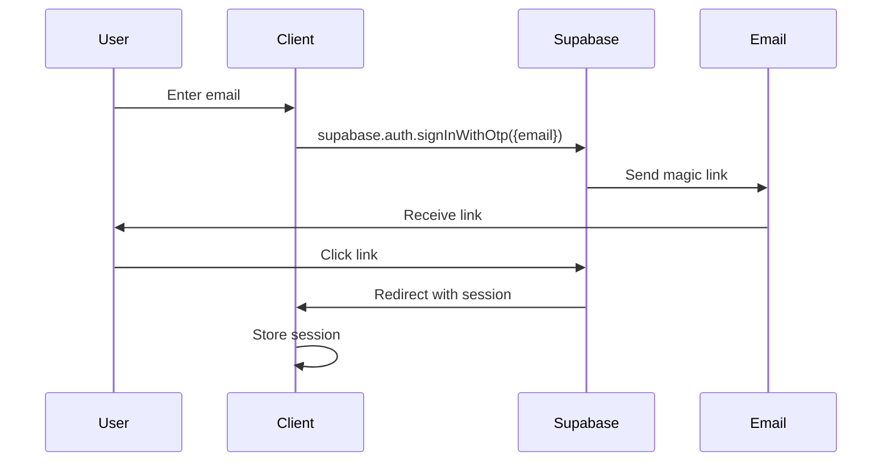

# Authentication Setup Guide

## 🔐 Overview

This system uses **Supabase Auth** with **passwordless magic link** authentication. The architecture supports role-based access control (RBAC) with `user` and `admin` roles stored in a custom `profiles` table.

## 🌍 Regional Configuration

### Service Locations
- **Supabase Project**: EU region (Frankfurt/Amsterdam) for GDPR compliance
- **API**: Railway EU (Amsterdam) - minimal auth latency
- **Admin**: Vercel EU (Frankfurt) - close to Supabase
- **Zep Memory**: US region (acknowledged latency ~100-150ms)

> **Note**: Zep US latency is mitigated by small retrieval sets (top_k=6-10) and early SSE streaming.

## 📧 Magic Link Flow

### 1. Email Request Flow


### 2. Configuration Requirements

#### Supabase Dashboard Settings
1. **Authentication → Providers → Email**
   - Enable Email provider
   - Disable "Confirm email" (for faster dev)
   - Set OTP expiry: 3600 seconds (1 hour)

2. **Authentication → URL Configuration**
   ```
   Site URL: https://admin.yourdomain.eu
   
   Redirect URLs (one per line):
   http://localhost:3001/*
   https://admin.yourdomain.eu/*
   myapp://auth/callback
   http://localhost:8081/*
   ```

3. **Email Templates**
   - Customize magic link email template
   - Include app branding
   - Clear CTA button

## 📱 Android Deep Link Configuration

### 1. URL Scheme Setup
```
Scheme: myapp
Host: auth
Path: /callback

Full URL: myapp://auth/callback?token=xxx&type=magiclink
```

### 2. AndroidManifest.xml Configuration
```xml
<activity android:name=".AuthCallbackActivity">
    <intent-filter>
        <action android:name="android.intent.action.VIEW" />
        <category android:name="android.intent.category.DEFAULT" />
        <category android:name="android.intent.category.BROWSABLE" />
        <data 
            android:scheme="myapp"
            android:host="auth"
            android:pathPrefix="/callback" />
    </intent-filter>
</activity>
```

### 3. Kotlin Handler
```kotlin
class AuthCallbackActivity : AppCompatActivity() {
    override fun onCreate(savedInstanceState: Bundle?) {
        super.onCreate(savedInstanceState)
        
        intent?.data?.let { uri ->
            val token = uri.getQueryParameter("token")
            val type = uri.getQueryParameter("type")
            
            if (type == "magiclink" && token != null) {
                // Exchange token for session
                supabaseClient.auth.verifyOtp(
                    type = OtpType.MAGIC_LINK,
                    token = token
                )
            }
        }
    }
}
```

## 🔑 JWT Verification (API Side)

### 1. JWKS-Based Verification

The API verifies Supabase JWTs using JWKS (JSON Web Key Sets) for performance and reliability:

```typescript
// Fastify middleware pseudocode
import jwksClient from 'jwks-rsa';
import jwt from 'jsonwebtoken';

const client = jwksClient({
  jwksUri: `${SUPABASE_URL}/auth/v1/.well-known/jwks.json`,
  cache: true,
  cacheMaxAge: 600000, // 10 minutes
});

async function verifySupabaseJWT(token: string) {
  const decoded = jwt.decode(token, { complete: true });
  const kid = decoded?.header?.kid;
  
  const key = await client.getSigningKey(kid);
  const signingKey = key.getPublicKey();
  
  return jwt.verify(token, signingKey, {
    audience: SUPABASE_JWT_AUD,
    issuer: `${SUPABASE_URL}/auth/v1`,
    algorithms: ['RS256'],
  });
}
```

### 2. Role Loading from Profiles

```typescript
interface UserContext {
  id: string;
  email: string;
  role: 'user' | 'admin';
}

async function loadUserContext(userId: string): Promise<UserContext> {
  // Query profiles table with service role
  const { data } = await supabaseAdmin
    .from('profiles')
    .select('role')
    .eq('user_id', userId)
    .single();
    
  return {
    id: userId,
    email: jwt.email,
    role: data?.role || 'user',
  };
}
```

### 3. Request Context Attachment

```typescript
// Attach to Fastify request
fastify.decorateRequest('user', null);

fastify.addHook('onRequest', async (request, reply) => {
  const token = request.headers.authorization?.replace('Bearer ', '');
  
  if (!token) {
    return reply.code(401).send({ error: 'Missing auth token' });
  }
  
  try {
    const payload = await verifySupabaseJWT(token);
    request.user = await loadUserContext(payload.sub);
  } catch (error) {
    return reply.code(401).send({ error: 'Invalid token' });
  }
});
```

## 👥 Roles & Profiles Table

### 1. Database Schema

```sql
-- Profiles table for role management
CREATE TABLE profiles (
  user_id UUID PRIMARY KEY REFERENCES auth.users(id) ON DELETE CASCADE,
  role TEXT NOT NULL DEFAULT 'user' CHECK (role IN ('user', 'admin')),
  display_name TEXT,
  created_at TIMESTAMPTZ DEFAULT NOW(),
  updated_at TIMESTAMPTZ DEFAULT NOW()
);

-- RLS Policies
ALTER TABLE profiles ENABLE ROW LEVEL SECURITY;

-- Users can read their own profile
CREATE POLICY "Users can read own profile" ON profiles
  FOR SELECT USING (auth.uid() = user_id);

-- Service role can manage all profiles
CREATE POLICY "Service role full access" ON profiles
  FOR ALL USING (auth.role() = 'service_role');

-- Trigger to create profile on signup
CREATE OR REPLACE FUNCTION handle_new_user()
RETURNS TRIGGER AS $$
BEGIN
  INSERT INTO public.profiles (user_id, role)
  VALUES (NEW.id, 'user');
  RETURN NEW;
END;
$$ LANGUAGE plpgsql SECURITY DEFINER;

CREATE TRIGGER on_auth_user_created
  AFTER INSERT ON auth.users
  FOR EACH ROW EXECUTE FUNCTION handle_new_user();
```

### 2. Admin Promotion

```sql
-- Manually promote user to admin (run as service role)
UPDATE profiles 
SET role = 'admin', updated_at = NOW()
WHERE user_id = 'uuid-of-user';
```

## 🚀 Implementation Checklist

### Phase 1 Setup Tasks

- [ ] **Supabase Project**
  - [ ] Create project in EU region
  - [ ] Enable Email provider
  - [ ] Configure redirect URLs
  - [ ] Customize email template
  
- [ ] **Database**
  - [ ] Create profiles table
  - [ ] Set up RLS policies
  - [ ] Create signup trigger
  - [ ] Seed admin user
  
- [ ] **API Integration**
  - [ ] Install JWKS client
  - [ ] Implement JWT verification
  - [ ] Create auth middleware
  - [ ] Add role checking
  
- [ ] **Admin App**
  - [ ] Configure Supabase client
  - [ ] Implement magic link UI
  - [ ] Handle auth redirects
  - [ ] Store session
  
- [ ] **Android App**
  - [ ] Configure deep links
  - [ ] Handle auth callbacks
  - [ ] Implement session storage
  - [ ] Test magic link flow

## 🔒 Security Considerations

1. **JWT Storage**
   - Web: httpOnly cookies or secure localStorage
   - Android: EncryptedSharedPreferences / Keystore

2. **Token Refresh**
   - Implement auto-refresh before expiry
   - Handle refresh failures gracefully

3. **Rate Limiting**
   - Limit magic link requests per email
   - Implement exponential backoff

4. **CORS Configuration**
   - Strict origin validation
   - Credentials only for trusted domains

## 🧪 Testing Magic Link Flow

### Local Development
```bash
# 1. Start Supabase locally (optional)
supabase start

# 2. Configure redirect URL for localhost
http://localhost:3001/auth/callback

# 3. Test email delivery
# Check Inbucket at http://localhost:54324
```

### Production Testing
1. Verify email arrives (check spam)
2. Confirm link redirects correctly
3. Check session persistence
4. Test role-based access

## 📊 Monitoring & Observability

### Key Metrics
- Magic link request rate
- Email delivery success rate
- Auth success/failure ratio
- JWT verification latency
- Role lookup cache hit rate

### Telemetry Events
```typescript
// Log auth events
{
  type: 'auth_request',
  user_id: null,
  email: 'user@example.com',
  timestamp: Date.now()
}

{
  type: 'auth_success',
  user_id: 'uuid',
  role: 'user',
  method: 'magic_link',
  timestamp: Date.now()
}

{
  type: 'auth_failure',
  reason: 'invalid_token',
  timestamp: Date.now()
}
```

## 🔗 Related Documentation

- [Environment Variables](./ENVIRONMENT.md#phase-1-auth)
- [Definition of Done](./DEFINITION_OF_DONE.md#phase-1)
- [Commands Reference](./COMMANDS.md#phase-1)
- [Supabase Auth Docs](https://supabase.com/docs/guides/auth/passwordless-login)