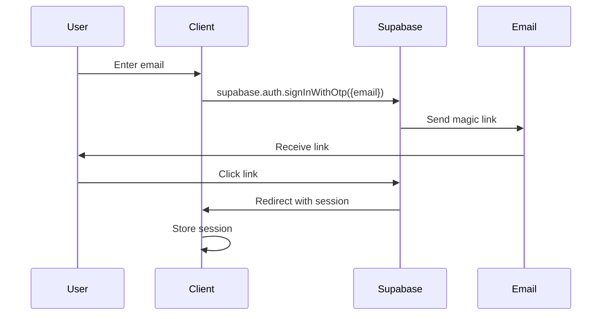
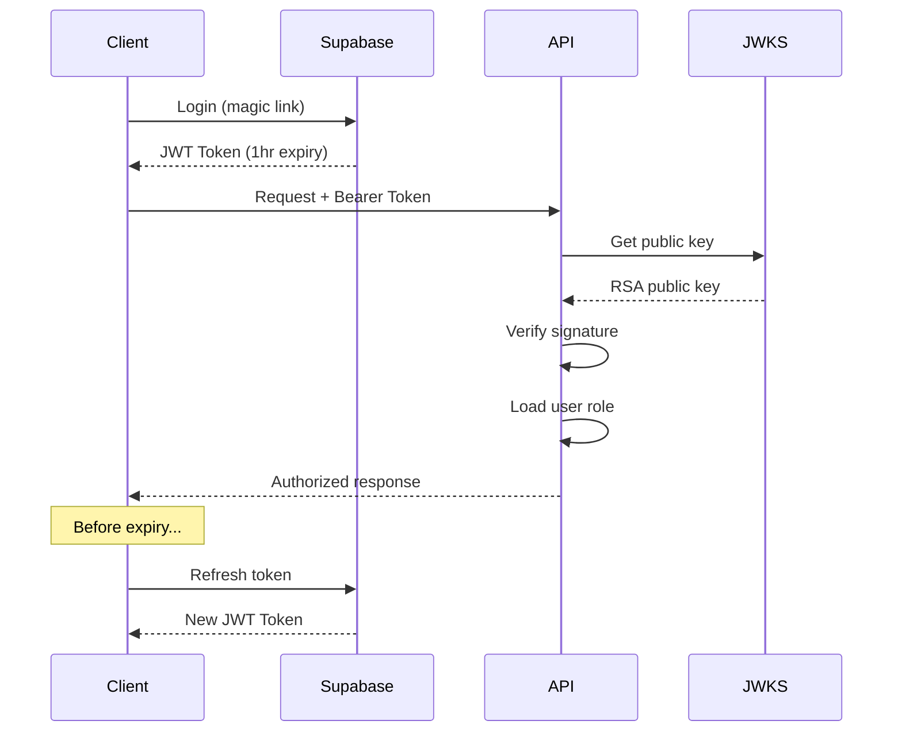

# Authentication Setup Guide

## 🔐 Overview

This system uses **Supabase Auth** with **passwordless magic link** authentication. The architecture supports role-based access control (RBAC) with `user` and `admin` roles stored in a custom `profiles` table.

## 🌍 Regional Configuration

### Service Locations
- **Supabase Project**: EU region (Frankfurt/Amsterdam) for GDPR compliance
- **API**: Railway EU (Amsterdam) - minimal auth latency
- **Admin**: Vercel EU (Frankfurt) - close to Supabase
- **Zep Memory**: US region (acknowledged latency ~100-150ms)

> **Note**: Zep US latency is mitigated by small retrieval sets (top_k=6-10) and early SSE streaming.

## 📧 Magic Link Flow

### 1. Email Request Flow


### 2. Configuration Requirements

#### Supabase Dashboard Settings
1. **Authentication → Providers → Email**
   - Enable Email provider
   - Disable "Confirm email" (for faster dev)
   - Set OTP expiry: 3600 seconds (1 hour)

2. **Authentication → URL Configuration**
   ```
   Site URL: https://admin.yourdomain.eu
   
   Redirect URLs (one per line):
   http://localhost:3001/*
   https://admin.yourdomain.eu/*
   myapp://auth/callback
   http://localhost:8081/*
   ```

3. **Email Templates**
   - Customize magic link email template
   - Include app branding
   - Clear CTA button

## 📱 Android Deep Link Configuration

### 1. URL Scheme Setup
```
Scheme: myapp
Host: auth
Path: /callback

Full URL: myapp://auth/callback?token=xxx&type=magiclink
```

### 2. AndroidManifest.xml Configuration
```xml
<activity android:name=".AuthCallbackActivity">
    <intent-filter>
        <action android:name="android.intent.action.VIEW" />
        <category android:name="android.intent.category.DEFAULT" />
        <category android:name="android.intent.category.BROWSABLE" />
        <data 
            android:scheme="myapp"
            android:host="auth"
            android:pathPrefix="/callback" />
    </intent-filter>
</activity>
```

### 3. Kotlin Handler
```kotlin
class AuthCallbackActivity : AppCompatActivity() {
    override fun onCreate(savedInstanceState: Bundle?) {
        super.onCreate(savedInstanceState)
        
        intent?.data?.let { uri ->
            val token = uri.getQueryParameter("token")
            val type = uri.getQueryParameter("type")
            
            if (type == "magiclink" && token != null) {
                // Exchange token for session
                supabaseClient.auth.verifyOtp(
                    type = OtpType.MAGIC_LINK,
                    token = token
                )
            }
        }
    }
}
```

## 🔑 JWT Verification (API Side)

### 1. JWKS-Based Verification

The API verifies Supabase JWTs using JWKS (JSON Web Key Sets) for performance and reliability:

```typescript
// Fastify middleware pseudocode
import jwksClient from 'jwks-rsa';
import jwt from 'jsonwebtoken';

const client = jwksClient({
  jwksUri: `${SUPABASE_URL}/auth/v1/.well-known/jwks.json`,
  cache: true,
  cacheMaxAge: 600000, // 10 minutes
});

async function verifySupabaseJWT(token: string) {
  const decoded = jwt.decode(token, { complete: true });
  const kid = decoded?.header?.kid;
  
  const key = await client.getSigningKey(kid);
  const signingKey = key.getPublicKey();
  
  return jwt.verify(token, signingKey, {
    audience: SUPABASE_JWT_AUD,
    issuer: `${SUPABASE_URL}/auth/v1`,
    algorithms: ['RS256'],
  });
}
```

### 2. Role Loading from Profiles

```typescript
interface UserContext {
  id: string;
  email: string;
  role: 'user' | 'admin';
}

async function loadUserContext(userId: string): Promise<UserContext> {
  // Query profiles table with service role
  const { data } = await supabaseAdmin
    .from('profiles')
    .select('role')
    .eq('user_id', userId)
    .single();
    
  return {
    id: userId,
    email: jwt.email,
    role: data?.role || 'user',
  };
}
```

### 3. Request Context Attachment

```typescript
// Attach to Fastify request
fastify.decorateRequest('user', null);

fastify.addHook('onRequest', async (request, reply) => {
  const token = request.headers.authorization?.replace('Bearer ', '');
  
  if (!token) {
    return reply.code(401).send({ error: 'Missing auth token' });
  }
  
  try {
    const payload = await verifySupabaseJWT(token);
    request.user = await loadUserContext(payload.sub);
  } catch (error) {
    return reply.code(401).send({ error: 'Invalid token' });
  }
});
```

## 👥 Roles & Profiles Table

### 1. Database Schema

```sql
-- Profiles table for role management
CREATE TABLE profiles (
  user_id UUID PRIMARY KEY REFERENCES auth.users(id) ON DELETE CASCADE,
  role TEXT NOT NULL DEFAULT 'user' CHECK (role IN ('user', 'admin')),
  display_name TEXT,
  created_at TIMESTAMPTZ DEFAULT NOW(),
  updated_at TIMESTAMPTZ DEFAULT NOW()
);

-- RLS Policies
ALTER TABLE profiles ENABLE ROW LEVEL SECURITY;

-- Users can read their own profile
CREATE POLICY "Users can read own profile" ON profiles
  FOR SELECT USING (auth.uid() = user_id);

-- Service role can manage all profiles
CREATE POLICY "Service role full access" ON profiles
  FOR ALL USING (auth.role() = 'service_role');

-- Trigger to create profile on signup
CREATE OR REPLACE FUNCTION handle_new_user()
RETURNS TRIGGER AS $$
BEGIN
  INSERT INTO public.profiles (user_id, role)
  VALUES (NEW.id, 'user');
  
  -- Call API webhook to initialize Zep (Phase 1+)
  -- Note: This requires pg_net extension or database webhook
  -- Alternative: Use Supabase Database Webhook in Dashboard
  RETURN NEW;
END;
$$ LANGUAGE plpgsql SECURITY DEFINER;

CREATE TRIGGER on_auth_user_created
  AFTER INSERT ON auth.users
  FOR EACH ROW EXECUTE FUNCTION handle_new_user();
```

### 2. Admin Promotion

#### Quick One-Liner Commands

```sql
-- One-liner to promote user to admin (requires service role)
UPDATE profiles SET role = 'admin' WHERE user_id = 'USER_UUID_HERE';

-- Using helper function (if migrations applied)
SELECT promote_to_admin('USER_UUID_HERE');

-- Demote admin back to user
UPDATE profiles SET role = 'user' WHERE user_id = 'USER_UUID_HERE';

-- Or using helper function
SELECT demote_to_user('USER_UUID_HERE');
```

#### Finding User IDs

```sql
-- Find user by email
SELECT id FROM auth.users WHERE email = 'admin@example.com';

-- List all users with their roles
SELECT 
    u.id as user_id,
    u.email,
    p.role,
    p.created_at
FROM auth.users u
LEFT JOIN profiles p ON u.id = p.user_id
ORDER BY p.created_at DESC;

-- List current admins
SELECT * FROM profiles WHERE role = 'admin';

-- Or using helper function
SELECT * FROM list_admins();
```

#### Verifying Admin Status

```sql
-- Check if specific user is admin
SELECT is_admin('USER_UUID_HERE');

-- Get user's current role
SELECT get_user_role('USER_UUID_HERE');

-- View role statistics
SELECT * FROM role_stats;
```

#### Audit Trail

```sql
-- View recent role changes (if audit logging enabled)
SELECT * FROM role_audit_log 
ORDER BY changed_at DESC 
LIMIT 10;
```

#### API/SDK Usage

```typescript
// Using Supabase Admin SDK (Node.js)
import { createClient } from '@supabase/supabase-js';

const supabaseAdmin = createClient(
  SUPABASE_URL,
  SUPABASE_SERVICE_KEY
);

// Promote user to admin
async function promoteToAdmin(userId: string) {
  const { data, error } = await supabaseAdmin
    .from('profiles')
    .update({ role: 'admin' })
    .eq('user_id', userId);
    
  if (error) throw error;
  return data;
}

// Check if user is admin
async function isUserAdmin(userId: string) {
  const { data, error } = await supabaseAdmin
    .rpc('is_admin', { check_user_id: userId });
    
  if (error) throw error;
  return data;
}
```

## 🔄 On-Signup Hook (Zep Initialization)

### Overview

When a new user signs up, the system initializes their Zep memory collection for storing chat history and facts. This is handled through an on-signup hook that can be triggered in multiple ways.

### Trigger Methods

#### 1. Automatic Trigger (Primary Method)

**The database trigger automatically creates profiles when users sign up.**

The migration `003_create_user_signup_trigger.sql` creates a trigger on `auth.users` that:
- Fires automatically when a new user signs up
- Creates a profile with default 'user' role
- Sets display_name from user metadata or email
- Works without any external configuration

**Note:** The trigger creation should work in Supabase. If you see an error about "must be owner of relation users", it's only from the COMMENT line which has been removed.

#### 2. API Auto-Creation (Fallback)

If the trigger doesn't work, the API automatically creates profiles on first authenticated request:
- When a user makes their first API call
- The auth middleware checks if profile exists
- Creates profile if missing (with default 'user' role)
- This ensures profiles always exist, even if trigger fails

#### 3. Manual Creation (Optional)

For existing users without profiles, run this SQL:

```typescript
// Admin Dashboard (Next.js)
const { data: { user } } = await supabase.auth.signUp({
  email: 'user@example.com',
  password: 'password',
});

if (user) {
  // Initialize Zep collection (non-blocking)
  fetch(`${API_BASE_URL}/auth/on-signup`, {
    method: 'POST',
    headers: { 'Content-Type': 'application/json' },
    body: JSON.stringify({
      user_id: user.id,
      email: user.email,
      created_at: user.created_at,
    }),
  }).catch(console.error); // Don't block on failure
}
```

```kotlin
// Android App
suspend fun onSignupSuccess(user: User) {
  // Initialize Zep collection (non-blocking)
  try {
    apiClient.post("/auth/on-signup") {
      setBody(OnSignupRequest(
        user_id = user.id,
        email = user.email,
        created_at = user.createdAt
      ))
    }
  } catch (e: Exception) {
    // Log but don't fail signup
    Log.w("Auth", "Failed to initialize Zep", e)
  }
}
```

#### 3. API-Side Auto-Creation

The API automatically creates profiles and initializes Zep on first authenticated request:

```typescript
// In auth plugin (already implemented)
const loadUserContext = async (payload: JWTPayload) => {
  const profile = await profilesClient.getProfile(userId);
  
  if (!profile) {
    // Auto-create profile
    await profilesClient.createProfile(userId);
    
    // Initialize Zep (non-blocking)
    zepClient.initializeUser(userId, payload.email)
      .catch(err => logger.warn('Zep init failed', err));
  }
};
```

### API Endpoint

**POST** `/auth/on-signup`

```typescript
// Request body
{
  "user_id": "uuid",      // Required
  "email": "string",      // Optional
  "created_at": "string"  // Optional
}

// Response
{
  "success": true,
  "message": "User signup processed",
  "zep_initialized": true  // false if Zep failed but signup succeeded
}
```

### Implementation Details

The on-signup hook:
1. **Never blocks signup** - Returns success even if Zep fails
2. **Idempotent** - Safe to call multiple times
3. **Logs telemetry** - Records `zep_upsert` event with timing
4. **Graceful degradation** - Works even if Zep is disabled

### Phase 1 Behavior (Current)

```typescript
// Stub implementation in /apps/api/src/services/zep.ts
async initializeUser(userId: string, email?: string) {
  if (!this.enabled) {
    // No Zep API key - skip initialization
    return { success: true };
  }
  
  // Simulate API calls (50-150ms delay)
  // Phase 3 will implement actual Zep API calls:
  // - POST /users to create user namespace
  // - POST /collections to create default collection
  
  return {
    success: true,
    timings: { createUser: 75, createCollection: 85, total: 160 }
  };
}
```

### Phase 3 Implementation (Future)

```typescript
// Real Zep v3 API calls
async initializeUser(userId: string, email?: string) {
  // Create user namespace
  await fetch(`${ZEP_BASE_URL}/users`, {
    method: 'POST',
    headers: {
      'Authorization': `Bearer ${ZEP_API_KEY}`,
      'Content-Type': 'application/json',
    },
    body: JSON.stringify({
      user_id: `user:${userId}`,
      email,
      metadata: {
        created_at: new Date().toISOString(),
        source: 'signup_hook',
      },
    }),
  });
  
  // Create default collection for chat history
  await fetch(`${ZEP_BASE_URL}/collections`, {
    method: 'POST',
    headers: {
      'Authorization': `Bearer ${ZEP_API_KEY}`,
      'Content-Type': 'application/json',
    },
    body: JSON.stringify({
      name: `user:${userId}:default`,
      description: `Chat history for user ${userId}`,
      metadata: {
        user_id: userId,
        type: 'chat_history',
      },
    }),
  });
}
```

### Telemetry Events

The hook logs the following telemetry:

```typescript
{
  type: 'zep_upsert',
  user_id: 'uuid',
  payload: {
    operation: 'user_initialization',
    success: true,
    zep_ms: 160,  // Total Zep API time
    error: null,  // Error message if failed
  },
  timestamp: '2024-01-01T00:00:00Z'
}
```

### Error Handling

Zep initialization failures are:
- **Logged** but not exposed to users
- **Non-blocking** for signup flow
- **Retryable** on next user action
- **Telemetry tracked** for monitoring

### Testing

```bash
# Test on-signup hook directly
curl -X POST http://localhost:3000/auth/on-signup \
  -H "Content-Type: application/json" \
  -d '{
    "user_id": "test-user-123",
    "email": "test@example.com"
  }'

# Response (success even if Zep disabled)
{
  "success": true,
  "message": "User signup processed",
  "zep_initialized": false
}

# Check Zep initialization status
curl http://localhost:3000/auth/zep-status/test-user-123 \
  -H "Authorization: Bearer $JWT_TOKEN"

# Response
{
  "initialized": true,
  "enabled": false  # true if ZEP_API_KEY is set
}
```

## 🚀 Implementation Checklist

### Phase 1 Setup Tasks

- [ ] **Supabase Project**
  - [ ] Create project in EU region
  - [ ] Enable Email provider
  - [ ] Configure redirect URLs
  - [ ] Customize email template
  
- [ ] **Database**
  - [ ] Create profiles table
  - [ ] Set up RLS policies
  - [ ] Create signup trigger (may fail on auth.users - that's OK)
  - [ ] **Configure database webhook for on-signup (REQUIRED - Option 1)**
  - [ ] Seed admin user
  
- [ ] **API Integration**
  - [ ] Install JWKS client
  - [ ] Implement JWT verification
  - [ ] Create auth middleware
  - [ ] Add role checking
  - [ ] Set up on-signup hook endpoint
  - [ ] Configure Zep client (stub for Phase 1)
  
- [ ] **Admin App**
  - [ ] Configure Supabase client
  - [ ] Implement magic link UI
  - [ ] Handle auth redirects
  - [ ] Store session
  
- [ ] **Android App**
  - [ ] Configure deep links
  - [ ] Handle auth callbacks
  - [ ] Implement session storage
  - [ ] Test magic link flow

## 🔒 Security Considerations

1. **JWT Storage**
   - Web: httpOnly cookies or secure localStorage
   - Android: EncryptedSharedPreferences / Keystore

2. **Token Refresh**
   - Implement auto-refresh before expiry
   - Handle refresh failures gracefully

3. **Rate Limiting**
   - Limit magic link requests per email
   - Implement exponential backoff

4. **CORS Configuration**
   - Strict origin validation
   - Credentials only for trusted domains

## 🧪 Testing Magic Link Flow

### Local Development
```bash
# 1. Start Supabase locally (optional)
supabase start

# 2. Configure redirect URL for localhost
http://localhost:3001/auth/callback

# 3. Test email delivery
# Check Inbucket at http://localhost:54324
```

### Production Testing
1. Verify email arrives (check spam)
2. Confirm link redirects correctly
3. Check session persistence
4. Test role-based access

## 📊 Monitoring & Observability

### Key Metrics
- Magic link request rate
- Email delivery success rate
- Auth success/failure ratio
- JWT verification latency
- Role lookup cache hit rate

### Telemetry Events
```typescript
// Log auth events
{
  type: 'auth_request',
  user_id: null,
  email: 'user@example.com',
  timestamp: Date.now()
}

{
  type: 'auth_success',
  user_id: 'uuid',
  role: 'user',
  method: 'magic_link',
  timestamp: Date.now()
}

{
  type: 'auth_failure',
  reason: 'invalid_token',
  timestamp: Date.now()
}
```

## 🔄 Token Usage in Apps

### How Tokens are Retrieved and Sent

#### Admin Dashboard (Next.js)

```typescript
// 1. Get token after authentication
import { createClient } from '@supabase/supabase-js';

const supabase = createClient(
  process.env.NEXT_PUBLIC_SUPABASE_URL,
  process.env.NEXT_PUBLIC_SUPABASE_ANON_KEY
);

// After successful login
const { data: { session } } = await supabase.auth.getSession();
const token = session?.access_token;

// 2. Send token with API requests
const response = await fetch(`${API_BASE_URL}/api/chat`, {
  method: 'POST',
  headers: {
    'Authorization': `Bearer ${token}`,
    'Content-Type': 'application/json',
  },
  body: JSON.stringify({ message: 'Hello' }),
});

// 3. Auto-refresh handling
supabase.auth.onAuthStateChange((event, session) => {
  if (event === 'TOKEN_REFRESHED') {
    // Update stored token
    updateApiToken(session?.access_token);
  }
});
```

#### Android App (Kotlin)

```kotlin
// 1. Get token after authentication
import io.github.jan.supabase.SupabaseClient
import io.github.jan.supabase.auth.auth
import io.github.jan.supabase.auth.providers.OtpProvider

class AuthService(private val supabase: SupabaseClient) {
    
    // After magic link callback
    suspend fun getAccessToken(): String? {
        return supabase.auth.currentSessionOrNull()?.accessToken
    }
    
    // 2. Send token with API requests
    suspend fun makeAuthenticatedRequest(endpoint: String, body: String) {
        val token = getAccessToken() ?: throw UnauthorizedException()
        
        val response = httpClient.post(endpoint) {
            header("Authorization", "Bearer $token")
            header("Content-Type", "application/json")
            setBody(body)
        }
    }
    
    // 3. Token refresh
    init {
        supabase.auth.sessionStatus.collect { status ->
            when (status) {
                is SessionStatus.Authenticated -> {
                    // Token refreshed automatically
                    updateStoredToken(status.session.accessToken)
                }
                is SessionStatus.NotAuthenticated -> {
                    // Handle logout
                    clearStoredToken()
                }
            }
        }
    }
}
```

#### API Server Token Verification

```typescript
// How the API verifies tokens (already implemented)
// 1. Extract from header
const token = request.headers.authorization?.replace('Bearer ', '');

// 2. Verify with JWKS
const payload = await verifyToken(token); // Uses JWKS endpoint

// 3. Load user context
const user = await loadUserContext(payload);
request.user = { id: payload.sub, email: payload.email, role: user.role };
```

### Token Lifecycle



### Token Storage Best Practices

#### Web (Admin Dashboard)
- **Storage**: Supabase client handles it (localStorage by default)
- **Security**: Consider using httpOnly cookies for production
- **Refresh**: Automatic via Supabase client

#### Mobile (Android)
- **Storage**: EncryptedSharedPreferences or Android Keystore
- **Security**: Never store in plain SharedPreferences
- **Refresh**: Handle in background before expiry

```kotlin
// Secure storage example
class SecureTokenStorage(context: Context) {
    private val sharedPreferences = EncryptedSharedPreferences.create(
        context,
        "auth_prefs",
        MasterKeys.getOrCreate(MasterKeys.AES256_GCM_SPEC),
        EncryptedSharedPreferences.PrefKeyEncryptionScheme.AES256_SIV,
        EncryptedSharedPreferences.PrefValueEncryptionScheme.AES256_GCM
    )
    
    fun saveToken(token: String) {
        sharedPreferences.edit()
            .putString("access_token", token)
            .apply()
    }
    
    fun getToken(): String? {
        return sharedPreferences.getString("access_token", null)
    }
}
```

### Common Token Issues

| Issue | Solution |
|-------|----------|
| Token expired (401) | Implement auto-refresh before expiry |
| Invalid signature | Ensure using correct JWKS endpoint |
| Missing user role | Check profiles table has user record |
| CORS errors | Configure CORS in API (Phase 8) |
| Token not sent | Check Authorization header format |

## 🔗 Related Documentation

- [Environment Variables](./ENVIRONMENT.md#phase-1-auth)
- [Definition of Done](./DEFINITION_OF_DONE.md#phase-1)
- [Commands Reference](./COMMANDS.md#phase-1)
- [Supabase Auth Docs](https://supabase.com/docs/guides/auth/passwordless-login)