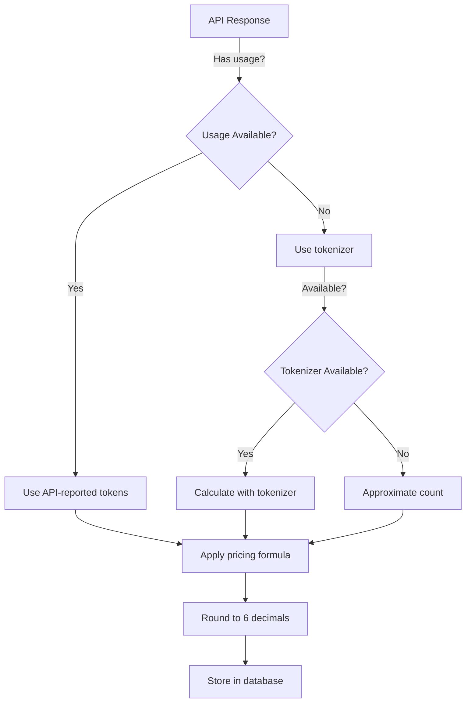

# Cost Calculation Specification

## Overview

This document defines the authoritative cost calculation rules for AI model usage in the AI Chat Task system. It covers formulas, precision requirements, data sources, and fallback behaviors.

## Core Formula

### Basic Cost Calculation

The fundamental cost formula for any AI model usage:

```
cost_usd = (input_tokens / 1,000,000) × input_per_mtok + 
           (output_tokens / 1,000,000) × output_per_mtok
```

Where:
- `input_tokens`: Number of input tokens consumed
- `output_tokens`: Number of output tokens generated
- `input_per_mtok`: Cost per million input tokens (USD)
- `output_per_mtok`: Cost per million output tokens (USD)

### Extended Formula with Caching

For models supporting cached/prompt-cached tokens:

```
cost_usd = (regular_input_tokens / 1,000,000) × input_per_mtok +
           (cached_input_tokens / 1,000,000) × cached_input_per_mtok +
           (output_tokens / 1,000,000) × output_per_mtok
```

Where:
- `regular_input_tokens` = `total_input_tokens - cached_input_tokens`
- `cached_input_per_mtok`: Discounted rate for cached tokens (typically 50% of regular rate)

## Precision Requirements

### Calculation Precision

| Stage | Decimal Places | Example | Purpose |
|-------|---------------|---------|---------|
| **Storage** | 6-8 decimals | 0.00031542 | Maximum precision in database |
| **Calculation** | 8 decimals | 0.00031542 | Prevent rounding errors during math |
| **API Response** | 6 decimals | 0.000315 | Balance precision and readability |
| **Display** | 4 decimals | $0.0003 | User-friendly presentation |
| **Aggregation** | 6 decimals | 0.000315 | Maintain accuracy in sums |

### Rounding Rules

1. **During Calculation**: Keep full precision (8 decimals)
2. **Before Storage**: Round to 6 decimals using banker's rounding
3. **For Display**: Round to 4 decimals for UI presentation
4. **For Billing**: Round to 6 decimals (never round up arbitrarily)

### Implementation Example

```typescript
// Calculation with full precision
const rawCost = (inputTokens / 1_000_000) * inputRate + 
                (outputTokens / 1_000_000) * outputRate;

// Storage (6 decimals)
const storedCost = Math.round(rawCost * 1_000_000) / 1_000_000;

// Display (4 decimals)
const displayCost = Math.round(storedCost * 10_000) / 10_000;
const formatted = `$${displayCost.toFixed(4)}`;
```

## Token Count Sources

### Priority Order (Source of Truth)

1. **API-Reported Usage** (Primary Path - Highest Priority)
   - OpenAI streaming response: `usage` field with `stream_options.include_usage: true`
   - OpenAI completion: `usage` object in response
   - Most accurate as it includes exact tokenization
   - Tracked with `has_provider_usage: true` in telemetry

2. **Model-Specific Tokenizer** (Fallback 1 - Not implemented in Phase 5)
   - Use tiktoken or model-specific tokenizer
   - Calculate based on actual text
   - Add 10% buffer for safety

3. **Approximate Count** (Fallback 2 - Phase 5 Implementation)
   - Estimate: ~1 token per 4 characters (average)
   - Combines word-based (1.3 tokens/word) and character-based (1 token/4 chars) estimates
   - No additional buffer needed due to averaging approach
   - Tracked with `has_provider_usage: false` in telemetry

### Data Flow



## Fallback Behaviors

### Missing Pricing Data

When model pricing is not found in `models_pricing` table:

1. **Log Warning**: Record missing model for admin attention
2. **Use Default Rates**: Apply conservative default pricing
3. **Flag Transaction**: Mark with `pricing_estimated = true`
4. **Notify Admin**: Add to pricing alerts queue

Default fallback rates:
```
input_per_mtok = 1.00 USD
output_per_mtok = 2.00 USD
cached_input_per_mtok = 0.50 USD
```

### Partial Token Data

When only partial token information is available:

| Scenario | Resolution |
|----------|------------|
| Input tokens missing | Estimate from request length |
| Output tokens missing | Estimate from response length |
| Both missing | Use character count approximation |
| Negative values | Treat as 0, log error |
| Overflow values | Cap at 1M tokens, log warning |

### API Failures

When OpenAI API fails to provide usage data:

1. **Check Response Headers**: Sometimes usage is in headers
2. **Parse Streamed Tokens**: Count tokens from stream
3. **Use Request/Response Size**: Approximate from byte count
4. **Apply Safety Margin**: Add 20% to approximated values

## Cost Validation

### Sanity Checks

Implement these validation rules:

```typescript
interface CostValidation {
  minCost: 0.0000001,     // Minimum billable amount
  maxCost: 1000.00,       // Maximum per-request cost
  maxTokens: 1_000_000,   // Maximum tokens per request
  minTokens: 1            // Minimum countable tokens
}

function validateCost(cost: number, tokens: TokenUsage): boolean {
  // Cost must be positive
  if (cost < 0) return false;
  
  // Cost must be within reasonable bounds
  if (cost < validation.minCost || cost > validation.maxCost) {
    logAnomaly('Cost out of bounds', { cost, tokens });
    return false;
  }
  
  // Token counts must be reasonable
  if (tokens.input < 1 || tokens.output < 0) return false;
  if (tokens.input > validation.maxTokens) return false;
  
  return true;
}
```

### Audit Trail

For each cost calculation, store:

```json
{
  "calculation_method": "api_reported" | "tokenizer" | "approximated",
  "raw_values": {
    "input_tokens": 152,
    "output_tokens": 423,
    "cached_tokens": 0
  },
  "rates_used": {
    "model": "gpt-4o-mini",
    "input_per_mtok": 0.15,
    "output_per_mtok": 0.60,
    "cached_per_mtok": null
  },
  "calculated_cost": 0.00031695,
  "stored_cost": 0.000317,
  "timestamp": "2025-01-19T10:30:00Z"
}
```

## Special Cases

### Streaming Responses

For SSE/streaming responses:

1. **Accumulate Tokens**: Count during stream
2. **Wait for Final Usage**: OpenAI sends usage in last chunk
3. **Reconcile Counts**: Prefer API usage over accumulated
4. **Calculate Once**: Only compute cost after stream completes

### Cached/Prompt Tokens

For models with caching:

1. **Identify Cached Portion**: API indicates cached token count
2. **Apply Discounted Rate**: Use `cached_input_per_mtok` if available
3. **Fall Back Gracefully**: Use regular rate if cached rate missing
4. **Track Savings**: Store both regular and discounted costs

### Batch Processing

For batch operations:

1. **Individual Costs**: Calculate per-request costs
2. **Aggregate Carefully**: Sum with full precision
3. **Round Once**: Only round final aggregate
4. **Store Both**: Keep individual and aggregate costs

## Examples

### Example 1: Standard Calculation

```
Input: 150 tokens
Output: 450 tokens
Model: gpt-4o-mini
Rates: $0.15/$0.60 per million

Calculation:
= (150 / 1,000,000) × 0.15 + (450 / 1,000,000) × 0.60
= 0.0000225 + 0.00027
= 0.0002925

Stored: 0.000293 (6 decimals)
Display: $0.0003 (4 decimals)
```

### Example 2: With Cached Tokens

```
Total Input: 1000 tokens (800 cached)
Output: 500 tokens
Model: gpt-4o
Rates: $2.50/$10.00/$1.25 per million

Calculation:
Regular input = 1000 - 800 = 200 tokens
= (200 / 1,000,000) × 2.50 +     // Regular input
  (800 / 1,000,000) × 1.25 +     // Cached input
  (500 / 1,000,000) × 10.00      // Output
= 0.0005 + 0.001 + 0.005
= 0.0065

Stored: 0.006500 (6 decimals)
Display: $0.0065 (4 decimals)
```

### Example 3: Fallback Approximation

```
Request text: "Hello, how are you?" (19 characters)
Response text: "I'm doing well..." (100 characters)
No API usage data available

Approximation:
Input ≈ 19 / 4 = 5 tokens (rounded up)
Output ≈ 100 / 4 = 25 tokens
Add 15% safety: 6 input, 29 output

Using default rates: $1.00/$2.00 per million
= (6 / 1,000,000) × 1.00 + (29 / 1,000,000) × 2.00
= 0.000006 + 0.000058
= 0.000064

Stored: 0.000064 (marked as estimated)
Display: $0.0001 (4 decimals)
```

## Monitoring & Alerts

### Cost Anomalies to Monitor

1. **Spike Detection**: Cost > 10x average for model
2. **Zero Costs**: Valid tokens but $0.00 cost
3. **Missing Pricing**: Model not in pricing table
4. **Precision Loss**: Rounding errors > 0.01%
5. **Negative Values**: Any negative cost calculation

### Metrics to Track

- Average cost per request by model
- Cost estimation accuracy (when API data becomes available)
- Frequency of fallback usage
- Precision loss from rounding
- Models with missing pricing

## Compliance Notes

1. **Never Round Up** for billing advantage
2. **Always Favor User** in ambiguous cases
3. **Log All Adjustments** for audit purposes
4. **Preserve Original Values** before any rounding
5. **Document Estimation Method** when not using API data

## Updates & Versioning

- **Version**: 1.0.0
- **Last Updated**: 2025-01-19
- **Review Schedule**: Monthly with pricing updates
- **Change Log**: Track all formula or precision changes

Changes to this specification require:
1. Admin approval
2. Update to all consuming services
3. Migration plan for historical data
4. User notification if billing impact