# Environment Variables Guide

## 🔐 Security First

### Critical Rules

1. **NEVER commit `.env.local` or `.env` files** - Only `.env.example` templates
2. **Use secrets management** in production (Railway/Vercel vault, GitHub secrets)
3. **Rotate keys regularly** - Especially after team member changes
4. **Audit access logs** - Monitor API key usage
5. **Principle of least privilege** - Apps only get the keys they need

### File Naming Convention

```
.env.example     ✅ Commit this - Template with placeholders
.env.local       ❌ Never commit - Local development secrets
.env.production  ❌ Never commit - Production secrets
.env             ❌ Never commit - Active environment file
```

## 🗂 Environment Structure

### API Service (`/apps/api`)

**Purpose**: Backend service handling all sensitive operations

**Key Categories**:

- **AI Services**: OpenAI, Zep memory management
- **Database**: Supabase service keys (full access)
- **Security**: JWT secrets, refresh tokens
- **CORS**: Allowed origins for admin and mobile apps

**Special Considerations**:

- Uses SERVICE keys for Supabase (not anon keys)
- Handles all AI API calls to protect keys
- Manages CORS for both web and mobile clients
- CORS plugin enforces strict origin validation - only configured origins allowed

### Admin Dashboard (`/apps/admin`)

**Purpose**: Web-based management interface

**Key Categories**:

- **Public Config**: API endpoints, app metadata
- **Supabase Public**: Anon keys for client-side auth
- **Feature Flags**: Build-time feature toggles

**NEXT*PUBLIC* Prefix Rules**:

- `NEXT_PUBLIC_*` = Exposed to browser, embedded at build time
- Without prefix = Server-side only (API routes, SSR)
- Only use NEXT*PUBLIC* for non-sensitive data

### Android App (`/apps/android`)

**Purpose**: Mobile application

**Key Categories**:

- **API Access**: Backend endpoints
- **Supabase Public**: Anon keys for auth
- **Deep Links**: URL scheme configuration

**Configuration Methods**:

- React Native: `react-native-config` package
- Native: `local.properties` + `BuildConfig`
- Never hardcode in source files

## 📌 Phase 1: Authentication Variables

### Required for Supabase Auth Setup

#### API Service (`/apps/api`)
```bash
# Supabase Auth (Phase 1)
SUPABASE_URL=https://xxxxxxxxxxxxxxxxxxxx.supabase.co
SUPABASE_SERVICE_ROLE_KEY=eyJhbGciOiJIUzI1NiIsInR5cCI6IkpXVCJ9.xxxxxxxxxxxx  # Service role key (⚠️ SERVER ONLY)
SUPABASE_JWT_SECRET=your-super-secret-jwt-secret-with-at-least-32-characters
SUPABASE_JWT_AUD=authenticated
SUPABASE_PROJECT_REF=xxxxxxxxxxxxxxxxxxxx

# JWKS Configuration (Phase 1)
JWKS_URI=https://xxxxxxxxxxxxxxxxxxxx.supabase.co/auth/v1/.well-known/jwks.json
JWKS_CACHE_TIME=600000  # 10 minutes in ms

# CORS Configuration
APP_ORIGIN_ADMIN=http://localhost:3001  # Admin dashboard origin
APP_ORIGIN_ANDROID_DEV=http://localhost:8081  # Android dev server origin
```

#### Admin Dashboard (`/apps/admin`)
```bash
# Supabase Auth (Phase 1)
NEXT_PUBLIC_SUPABASE_URL=https://xxxxxxxxxxxxxxxxxxxx.supabase.co
NEXT_PUBLIC_SUPABASE_ANON_KEY=eyJhbGciOiJIUzI1NiIsInR5cCI6IkpXVCJ9.xxxxxxxxxxxx  # Anon key only
NEXT_PUBLIC_APP_URL=http://localhost:3001  # For auth redirects

# Phase 2: Server-side only (for API routes/SSR)
SUPABASE_SERVICE_ROLE_KEY=eyJhbGciOiJIUzI1NiIsInR5cCI6IkpXVCJ9.xxxxxxxxxxxx  # ⚠️ NEVER expose to client
```

#### Android App (`/apps/android`)
```properties
# In local.properties or build config
supabase.url=https://xxxxxxxxxxxxxxxxxxxx.supabase.co
supabase.anonKey=eyJhbGciOiJIUzI1NiIsInR5cCI6IkpXVCJ9.xxxxxxxxxxxx
app.deeplink.scheme=myapp
app.deeplink.host=auth
```

### Deep Link Configuration

**Supabase Redirect URLs** (add in Dashboard → Authentication → URL Configuration):
```
http://localhost:3001/auth/callback     # Admin local dev
https://admin.yourdomain.eu/auth/callback  # Admin production
myapp://auth/callback                   # Android deep link
http://localhost:8081/auth/callback     # Android dev (if using web view)
```

## 📊 Phase 2: Telemetry & Pricing Variables

### Required for Telemetry System

#### API Service (`/apps/api`)
```bash
# Phase 2: Telemetry Writing (SERVER ONLY)
# Uses existing SUPABASE_URL from Phase 1
# Uses existing SUPABASE_SERVICE_ROLE_KEY from Phase 1
# Service role key required for:
# - Writing to telemetry_events table
# - Updating daily_usage aggregates
# - Managing models_pricing

# No additional variables needed - reuses Phase 1 service credentials
```

#### Admin Dashboard (`/apps/admin`)
```bash
# Phase 2: Telemetry Reading (SERVER-SIDE ROUTES ONLY)
# For Next.js API routes and SSR pages that read telemetry

# Server-side variables (NOT prefixed with NEXT_PUBLIC_)
SUPABASE_SERVICE_ROLE_KEY=eyJhbGciOiJIUzI1NiIsInR5cCI6IkpXVCJ9.xxxxxxxxxxxx  # ⚠️ SERVER ONLY

# These are used in:
# - /api/admin/metrics - Read telemetry_events and daily_usage
# - /api/admin/pricing - Read/update models_pricing
# - /api/admin/users - Read user telemetry data
```

### Security Boundaries

| Variable | API | Admin (Server) | Admin (Client) | Android |
|----------|-----|---------------|----------------|---------|
| `SUPABASE_URL` | ✅ | ✅ | ✅ (public) | ✅ |
| `SUPABASE_ANON_KEY` | ❌ | ❌ | ✅ (public) | ✅ |
| `SUPABASE_SERVICE_ROLE_KEY` | ✅ | ✅ (SSR only) | ❌ NEVER | ❌ NEVER |

### Telemetry Data Flow

```mermaid
graph LR
    A[API Backend] -->|Service Role| B[telemetry_events]
    A -->|Service Role| C[daily_usage]
    A -->|Service Role| D[models_pricing]
    
    E[Admin SSR] -->|Service Role| B
    E -->|Service Role| C
    E -->|Service Role| D
    
    F[Admin Client] -->|No Access| G[❌ Blocked by RLS]
    H[Android App] -->|No Access| G
    
    style A fill:#90EE90
    style E fill:#90EE90
    style F fill:#FFB6C1
    style H fill:#FFB6C1
```



## 🌍 EU Region Deployment

### Service Selection for GDPR Compliance

```
API:
  Primary: Railway (Frankfurt/Amsterdam)
  Alternative: Render.com (Frankfurt)

Admin:
  Primary: Vercel (Frankfurt - eu-central-1)
  Alternative: Netlify (Frankfurt)

Database:
  Primary: Supabase (Frankfurt - eu-central-1)
  Alternative: Neon.tech (EU regions)

Memory/Vector:
  Primary: Zep (self-hosted in EU)
  Alternative: Pinecone (EU-West)
```

## 📋 Platform Setup Checklists

### Railway (API Deployment)

```bash
# 1. Install Railway CLI
curl -fsSL https://railway.app/install.sh | sh

# 2. Login and initialize
railway login
railway init

# 3. Set environment variables
railway variables set NODE_ENV=production
railway variables set PORT=3000
railway variables set OPENAI_API_KEY=sk-proj-xxx
railway variables set ZEP_API_KEY=z_xxx
railway variables set SUPABASE_URL=https://xxx.supabase.co
railway variables set SUPABASE_SERVICE_ROLE_KEY=eyJhbG...
railway variables set DATABASE_URL=postgresql://...
railway variables set APP_ORIGIN_ADMIN=https://admin.yourdomain.eu
railway variables set APP_ORIGIN_ANDROID_DEV=https://api.yourdomain.eu

# 4. Deploy
railway up
```

### Vercel (Admin Deployment)

```bash
# 1. Install Vercel CLI
npm i -g vercel

# 2. Login and link project
vercel login
vercel link

# 3. Set environment variables (via CLI or Dashboard)
vercel env add NEXT_PUBLIC_API_BASE_URL
vercel env add NEXT_PUBLIC_SUPABASE_URL
vercel env add NEXT_PUBLIC_SUPABASE_ANON_KEY
vercel env add NEXT_PUBLIC_FEATURE_PRICING_EDITOR

# 4. Deploy to production
vercel --prod

# Alternative: Use Vercel Dashboard
# Settings → Environment Variables → Add all from .env.example
```

### Supabase Setup

```bash
# 1. Create project in EU region (Frankfurt)
# Visit: https://app.supabase.com/new/project

# 2. Get credentials from Dashboard
# Settings → API → Copy:
# - Project URL → SUPABASE_URL / NEXT_PUBLIC_SUPABASE_URL
# - Anon Key → NEXT_PUBLIC_SUPABASE_ANON_KEY (client apps)
# - Service Key → SUPABASE_SERVICE_ROLE_KEY (API only!)

# 3. Configure Auth
# Authentication → Settings → Site URL
# Add: https://admin.yourdomain.eu

# 4. Set up Row Level Security (RLS)
# Table Editor → Select table → RLS → Enable
```

## 🔄 Environment Variable Flow


## 🚀 Quick Start Commands

### Local Development Setup

```bash
# API Setup
cd apps/api
cp .env.example .env.local
# Edit .env.local with your keys
pnpm dev

# Admin Setup
cd apps/admin
cp .env.example .env.local
# Edit .env.local with your keys
pnpm dev

# Android Setup
cd apps/android
# For React Native:
cp .env.example .env.development
# For Native: Edit local.properties
```

### Production Deployment

```bash
# 1. Ensure all .env.example files are updated
git add apps/*/.env.example
git commit -m "chore: update env templates"

# 2. Deploy API to Railway
cd apps/api
railway up

# 3. Deploy Admin to Vercel
cd apps/admin
vercel --prod

# 4. Build Android for release
cd apps/android
./gradlew assembleRelease  # or bundleRelease for AAB
```

## 🔍 Variable Reference

### Naming Conventions

| Pattern         | Usage               | Example                         |
| --------------- | ------------------- | ------------------------------- |
| `NEXT_PUBLIC_*` | Next.js client-side | `NEXT_PUBLIC_API_BASE_URL`      |
| `*_URL`         | Service endpoints   | `SUPABASE_URL`, `API_BASE_URL`  |
| `*_KEY`         | API keys            | `OPENAI_API_KEY`, `ZEP_API_KEY` |
| `*_SECRET`      | Private keys        | `JWT_SECRET`, `SESSION_SECRET`  |
| `FEATURE_*`     | Feature flags       | `FEATURE_PRICING_EDITOR`        |
| `APP_*`         | App configuration   | `APP_ORIGIN_ADMIN`              |

### Common Issues & Solutions

| Issue                   | Solution                                    |
| ----------------------- | ------------------------------------------- |
| CORS errors in browser  | Check `APP_ORIGIN_*` variables in API - only exact matches allowed |
| Preflight fails (403)   | Origin not in `APP_ORIGIN_ADMIN` or `APP_ORIGIN_ANDROID_DEV` |
| Build fails on Vercel   | Ensure all `NEXT_PUBLIC_*` vars are set     |
| Android can't reach API | Use `10.0.2.2` for emulator localhost       |
| Supabase auth fails     | Verify anon vs service key usage            |
| Environment not loading | Check file naming (`.env.local` not `.env`) |

## 📊 Monitoring & Debugging

### Check Active Environment

```javascript
// API (Node.js)
console.log('Environment:', process.env.NODE_ENV);
console.log('API Keys loaded:', {
  openai: !!process.env.OPENAI_API_KEY,
  zep: !!process.env.ZEP_API_KEY,
  supabase: !!process.env.SUPABASE_URL,
});

// Admin (Next.js)
console.log('Public vars:', {
  api: process.env.NEXT_PUBLIC_API_BASE_URL,
  supabase: process.env.NEXT_PUBLIC_SUPABASE_URL,
});

// Android (React Native)
import Config from 'react-native-config';
console.log('Config:', Config);
```

### Security Audit Checklist

- [ ] No secrets in git history: `git log -p | grep -E "(key|secret|password)"`
- [ ] All production keys rotated from development
- [ ] Service keys only in API, never in client apps
- [ ] CORS origins explicitly defined
- [ ] Rate limiting configured on API endpoints
- [ ] Supabase RLS policies enabled
- [ ] Error messages don't leak sensitive info

## 🆘 Emergency Procedures

### If a Key is Compromised

1. **Immediately revoke** the compromised key
2. **Generate new key** from service dashboard
3. **Update in platform** (Railway/Vercel/etc)
4. **Redeploy all affected services**
5. **Audit logs** for unauthorized usage
6. **Notify team** of the incident

### Rollback Procedure

```bash
# Railway - Rollback API
railway rollback

# Vercel - Rollback Admin
vercel rollback

# Check previous deployments
railway deployments
vercel list
```

## 📚 Additional Resources

- [Railway Environment Variables](https://docs.railway.app/develop/variables)
- [Vercel Environment Variables](https://vercel.com/docs/environment-variables)
- [Supabase Environment Variables](https://supabase.com/docs/guides/functions/secrets)
- [Next.js Environment Variables](https://nextjs.org/docs/basic-features/environment-variables)
- [React Native Config](https://github.com/luggit/react-native-config)
