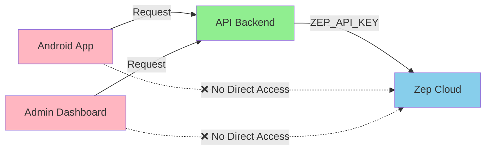

# Zep v3 Integration Documentation

## Overview

Zep v3 provides persistent memory and knowledge graph capabilities for our AI Chat system. It stores conversation history, enables semantic search across past interactions, and maintains user-specific context through a graph-based knowledge representation.

**Version**: Zep v3 (latest)  
**Deployment**: Cloud-hosted (US region)  
**Access**: Server-side only via API backend  
**Documentation**: [https://docs.getzep.com/](https://docs.getzep.com/)

## Architecture Decisions

### Server-Only Access Policy

**Critical Security Requirement**: Zep API keys are **NEVER** exposed to client applications.



All Zep operations are proxied through our API backend:
- Clients send requests to our API endpoints
- API backend authenticates the user via Supabase JWT
- API backend makes Zep API calls with server-side key
- Results are filtered and returned to clients

### Regional Deployment & Latency

**Important**: Zep is hosted in **US regions** while our infrastructure is in **EU**.

| Component | Region | Latency Impact |
|-----------|--------|---------------|
| API Backend | EU (Amsterdam) | Baseline |
| Zep Cloud | US (Virginia) | +100-150ms RTT |
| OpenAI | Global | Variable |

**Mitigation Strategies**:
1. **Async Operations**: Write operations (memory storage) are queued
2. **Caching**: Frequently accessed memories cached in API (future: Redis)
3. **Batch Operations**: Group multiple operations when possible
4. **Streaming First**: Start OpenAI stream while Zep search runs in parallel

## Zep v3 APIs Used

### 1. Collections API

**Purpose**: Multi-tenant conversation storage with user isolation

```typescript
// API: POST /collections
// Create a user-specific collection
{
  "name": "user:a0eebc99-9c0b-4ef8-bb6d-6bb9bd380a11",
  "description": "Conversation history for user",
  "metadata": {
    "created_at": "2025-01-19T10:00:00Z",
    "user_email": "user@example.com"
  }
}
```

**Operations**:
- `GET /collections/{collection_id}` - Retrieve collection details
- `POST /collections` - Create new user collection
- `DELETE /collections/{collection_id}` - Remove user data (GDPR)
- `PATCH /collections/{collection_id}` - Update metadata

### 2. Messages API

**Purpose**: Store and retrieve conversation messages

```typescript
// API: POST /collections/{collection_id}/sessions/{session_id}/messages
// Add a message to conversation history
{
  "role": "user" | "assistant",
  "content": "Message text",
  "metadata": {
    "model": "gpt-4o-mini",
    "tokens": 150,
    "timestamp": "2025-01-19T10:00:00Z"
  }
}
```

**Operations**:
- `POST /collections/{collection_id}/sessions/{session_id}/messages` - Add message
- `GET /collections/{collection_id}/sessions/{session_id}/messages` - Get history
- `DELETE /collections/{collection_id}/sessions/{session_id}/messages/{message_id}` - Remove message

### 3. Search API

**Purpose**: Semantic search across user's conversation history

```typescript
// API: POST /collections/{collection_id}/search
// Search for relevant memories
{
  "query": "What did we discuss about authentication?",
  "limit": 10,
  "min_score": 0.7,
  "filters": {
    "session_id": "specific-session"  // Optional
  }
}
```

**Response Structure**:
```typescript
{
  "results": [
    {
      "message": { /* Message object */ },
      "score": 0.92,
      "session_id": "session-123",
      "metadata": { /* Additional context */ }
    }
  ]
}
```

### 4. Knowledge Graph API

**Purpose**: Store and query structured knowledge about users

```typescript
// API: POST /collections/{collection_id}/knowledge
// Add knowledge facts
{
  "facts": [
    {
      "subject": "user",
      "predicate": "prefers",
      "object": "TypeScript",
      "confidence": 0.9
    },
    {
      "subject": "user",
      "predicate": "works_at",
      "object": "TechCorp",
      "confidence": 1.0
    }
  ]
}
```

**Graph Operations**:
- `POST /collections/{collection_id}/knowledge` - Add facts
- `GET /collections/{collection_id}/knowledge/query` - Query graph
- `DELETE /collections/{collection_id}/knowledge/{fact_id}` - Remove fact

**Query Examples**:
```typescript
// Get all facts about user preferences
GET /collections/{collection_id}/knowledge/query?subject=user&predicate=prefers

// Get user's location and work
GET /collections/{collection_id}/knowledge/query?subject=user&predicate_in=works_at,located_in
```

## API Integration Pattern

### Request Flow

```typescript
// apps/api/src/services/zep.ts

import { RetrievalConfig, OntologySettings } from '@packages/shared/admin-settings';
import { applyRetrievalPolicy } from './retrieval';
import { extractKnowledge } from './ontology';

class ZepService {
  private client: ZepClient;
  private retrievalConfig: RetrievalConfig;
  private ontologySettings: OntologySettings;
  
  constructor(adminSettings: AdminMemorySettings) {
    this.client = new ZepClient({
      apiKey: process.env.ZEP_API_KEY,  // Server-only
      baseUrl: process.env.ZEP_BASE_URL
    });
    
    // Load policy configurations
    this.retrievalConfig = adminSettings.retrieval;
    this.ontologySettings = adminSettings.ontology;
  }
  
  async searchMemories(userId: string, query: string): Promise<Memory[]> {
    const collectionName = `user:${userId}`;
    
    try {
      // Search with policy-defined limit (2x for filtering)
      const results = await this.client.search({
        collection: collectionName,
        query,
        limit: this.retrievalConfig.topK * 2,
        timeout: 3000  // 3s timeout for US region
      });
      
      // Apply retrieval policy (dedup, clip, interleave, budget)
      const processedMemories = await applyRetrievalPolicy(
        results,
        this.retrievalConfig
      );
      
      return processedMemories;
    } catch (error) {
      // Log but don't fail the request
      logger.warn('Zep search failed, continuing without memory', error);
      return [];
    }
  }
  
  async storeMessage(
    userId: string, 
    sessionId: string, 
    message: Message
  ): Promise<void> {
    // Extract knowledge using ontology rules
    const facts = await extractKnowledge(
      message,
      this.ontologySettings
    );
    
    // Store message and facts
    const promises = [
      this.client.addMessage({
        collection: `user:${userId}`,
        session: sessionId,
        message
      }),
      facts.length > 0 ? this.client.addFacts({
        collection: `user:${userId}`,
        facts
      }) : Promise.resolve()
    ];
    
    // Fire-and-forget pattern for writes
    Promise.all(promises).catch(error => {
      // Log but don't block the response
      logger.error('Failed to store in Zep', error);
      // Queue for retry if critical
      this.retryQueue.add({ userId, sessionId, message, facts });
    });
  }
}
```

## Performance Optimization

### 1. Parallel Execution

```typescript
// Execute Zep search and OpenAI call in parallel
const [memories, openAiStream] = await Promise.all([
  zepService.searchMemories(userId, query),
  openAiService.createStream(prompt)
]);
```

### 2. Memory Retrieval Policy

Memory retrieval follows the deterministic rules defined in [RETRIEVAL_POLICY.md](./RETRIEVAL_POLICY.md):

- **Top-K Results**: 6-10 results (default: 8)
- **Content Clipping**: 1-2 sentences per fact
- **Token Budget**: ≤1500 tokens maximum
- **Deduplication**: Normalized text hashing
- **Interleaving**: Alternates relevance and recency

```typescript
import { RetrievalConfig } from '../shared/admin-settings';
import { applyRetrievalPolicy } from '../services/retrieval';

// Use policy-driven retrieval
const memories = await applyRetrievalPolicy(
  rawZepResults,
  adminSettings.memory.retrieval
);
```

### 3. Knowledge Graph Ontology

Entity extraction and relationship management follow [ONTOLOGY.md](./ONTOLOGY.md):

- **Allowed Predicates**: likes, works_at, located_in, knows, owns, interested_in, visited, uses
- **Entity Normalization**: Lowercase, NFKC, trim
- **Edge Limits**: Max 3 new edges per message
- **Confidence Scoring**: 0.0-1.0 heuristic-based

```typescript
import { OntologySettings } from '../shared/admin-settings';
import { extractKnowledge } from '../services/ontology';

// Extract facts using ontology rules
const facts = await extractKnowledge(
  message,
  adminSettings.memory.ontology
);
```

### 4. Caching Strategy (Future)

```typescript
// Redis cache for frequently accessed memories
const CACHE_TTL = 300;  // 5 minutes

async function getCachedMemories(
  userId: string, 
  query: string
): Promise<Memory[] | null> {
  const cacheKey = `zep:${userId}:${hashQuery(query)}`;
  return redis.get(cacheKey);
}
```

## Error Handling

### Graceful Degradation

Zep failures should **never** block the primary chat flow:

```typescript
async function handleChatRequest(request: ChatRequest) {
  // Try to get memories, but continue without them
  let memories: Memory[] = [];
  
  try {
    memories = await zepService.searchMemories(
      request.userId, 
      request.message
    );
  } catch (error) {
    logger.warn('Zep unavailable, proceeding without memory context');
    // Track in telemetry
    await telemetry.recordEvent({
      type: 'zep_error',
      error: error.message
    });
  }
  
  // Continue with OpenAI call even if Zep fails
  const response = await openAiService.chat({
    messages: request.messages,
    context: memories  // May be empty
  });
  
  return response;
}
```

### Retry Logic

```typescript
class ZepRetryQueue {
  async processQueue() {
    const items = await this.getQueuedItems();
    
    for (const item of items) {
      try {
        await this.retryWithBackoff(item, {
          maxRetries: 3,
          initialDelay: 1000,
          maxDelay: 10000
        });
      } catch (error) {
        // After all retries, log and discard
        logger.error('Failed to store in Zep after retries', error);
        await telemetry.recordEvent({
          type: 'zep_permanent_failure',
          payload: item
        });
      }
    }
  }
}
```

## Security Considerations

### API Key Management

```yaml
# Environment Variables (SERVER ONLY)
ZEP_API_KEY: z_proj_xxxxxxxxxxxxxx  # NEVER expose to clients
ZEP_BASE_URL: https://api.getzep.com/v3
```

### Data Privacy

1. **User Isolation**: Each user's data in separate collection
2. **No Cross-User Access**: Collections named with Supabase user ID
3. **Sanitization**: All Zep responses sanitized before client return
4. **PII Handling**: No passwords, tokens, or keys stored in Zep

### Access Control

```typescript
// Verify user owns the collection before any operation
async function verifyCollectionAccess(
  userId: string, 
  collectionName: string
): boolean {
  const expectedName = `user:${userId}`;
  return collectionName === expectedName;
}
```

## Monitoring & Telemetry

### Key Metrics

```typescript
// Track Zep performance in telemetry_events
await telemetry.recordEvent({
  type: 'zep_search',
  payload_json: {
    zep_ms: responseTime,
    result_count: results.length,
    query_length: query.length,
    cache_hit: false
  }
});

await telemetry.recordEvent({
  type: 'zep_upsert',
  payload_json: {
    zep_ms: responseTime,
    message_count: messages.length,
    collection: collectionName
  }
});
```

### Alerts Configuration

| Metric | Threshold | Action |
|--------|-----------|--------|
| Zep response time | > 2000ms | Log warning |
| Zep error rate | > 5% | Alert on-call |
| Collection size | > 10MB | Trigger pruning |
| Search timeout | > 3000ms | Use cached results |

## Migration & Cleanup

### User Data Export (GDPR)

```typescript
async function exportUserData(userId: string): Promise<UserDataExport> {
  const collectionName = `user:${userId}`;
  
  // Get all messages
  const messages = await zepClient.getAllMessages(collectionName);
  
  // Get knowledge graph
  const knowledge = await zepClient.getKnowledge(collectionName);
  
  // Get metadata
  const metadata = await zepClient.getCollection(collectionName);
  
  return {
    messages,
    knowledge,
    metadata,
    exportDate: new Date()
  };
}
```

### User Data Deletion

```typescript
async function deleteUserData(userId: string): Promise<void> {
  const collectionName = `user:${userId}`;
  
  // Delete entire collection (cascades to messages and knowledge)
  await zepClient.deleteCollection(collectionName);
  
  // Log deletion for compliance
  await auditLog.record({
    action: 'user_data_deleted',
    userId,
    timestamp: new Date(),
    service: 'zep'
  });
}
```

## Development & Testing

### Local Development

For local development without Zep:

```typescript
class MockZepService implements IZepService {
  private memory: Map<string, Memory[]> = new Map();
  
  async searchMemories(userId: string, query: string): Promise<Memory[]> {
    // Return mock memories for testing
    return this.memory.get(userId) || [];
  }
  
  async storeMessage(userId: string, sessionId: string, message: Message) {
    // Store in local memory
    const key = userId;
    const memories = this.memory.get(key) || [];
    memories.push({ ...message, sessionId });
    this.memory.set(key, memories);
  }
}

// Use mock in development
const zepService = process.env.NODE_ENV === 'development' 
  ? new MockZepService()
  : new ZepService();
```

### Integration Tests

```typescript
describe('Zep Integration', () => {
  it('should handle Zep timeout gracefully', async () => {
    // Mock Zep timeout
    jest.spyOn(zepClient, 'search').mockRejectedValue(
      new Error('Timeout')
    );
    
    const response = await api.post('/chat', {
      message: 'Hello'
    });
    
    // Should still return response without memory
    expect(response.status).toBe(200);
    expect(response.data).toHaveProperty('response');
  });
});
```

## Roadmap & Future Enhancements

### Phase 3 (Current)
- ✅ Basic Zep integration
- ✅ Message storage
- ✅ Memory search
- ⏳ Knowledge graph (minimal)

### Phase 4+ (Future)
- [ ] Redis caching layer
- [ ] Batch message uploads
- [ ] Advanced graph queries
- [ ] Memory summarization
- [ ] Cross-session learning
- [ ] EU Zep deployment (when available)

## References

- [Zep v3 API Documentation](https://docs.getzep.com/api)
- [Zep SDK (TypeScript)](https://github.com/getzep/zep-js)
- [Zep Cloud Pricing](https://www.getzep.com/pricing)
- [Zep Security & Compliance](https://www.getzep.com/security)