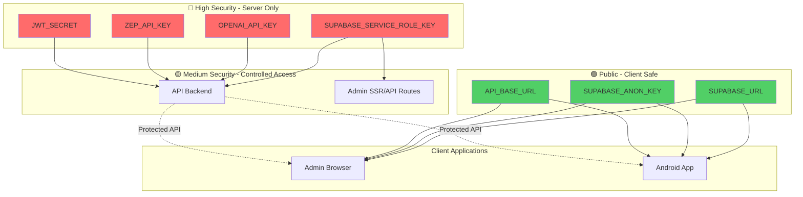

# Secrets Matrix - Security Boundaries

## Overview

This document defines the security boundaries for all secrets and credentials in the AI Chat Task system. It specifies which services have access to which secrets and enforces strict separation between server-side and client-side credentials.

## 🔐 Critical Security Rules

1. **Service Role Keys are SERVER-ONLY** - Never expose to any client application
2. **Anon Keys are CLIENT-ONLY** - Use for public-facing authentication
3. **API Keys stay in API** - AI service keys never leave the backend
4. **Audit all access** - Log and monitor service role key usage

## 📊 Complete Secrets Matrix

### Phase 1: Authentication Secrets

| Secret | Type | API Service | Admin Server | Admin Client | Android | Railway | Vercel |
|--------|------|------------|--------------|--------------|---------|---------|--------|
| `SUPABASE_URL` | Public | ✅ | ✅ | ✅ | ✅ | ✅ | ✅ |
| `SUPABASE_ANON_KEY` | Public | ❌ | ❌ | ✅ | ✅ | ❌ | ✅ |
| `SUPABASE_SERVICE_ROLE_KEY` | **SENSITIVE** | ✅ | ✅ SSR | ❌ **NEVER** | ❌ **NEVER** | ✅ | ✅ Server |
| `SUPABASE_JWT_SECRET` | **SENSITIVE** | ✅ | ❌ | ❌ | ❌ | ✅ | ❌ |
| `JWKS_URI` | Public | ✅ | ❌ | ❌ | ❌ | ✅ | ❌ |

### Phase 2: Telemetry Secrets

| Secret | Type | API Service | Admin Server | Admin Client | Android | Railway | Vercel |
|--------|------|------------|--------------|--------------|---------|---------|--------|
| **Telemetry Write Access** | | | | | | | |
| `SUPABASE_SERVICE_ROLE_KEY` | **SENSITIVE** | ✅ Write | ✅ Read | ❌ | ❌ | ✅ | ✅ Server |
| **RLS Enforcement** | | | | | | | |
| `telemetry_events` access | Service Role | ✅ R/W | ✅ R | ❌ Blocked | ❌ Blocked | - | - |
| `daily_usage` access | Service Role | ✅ R/W | ✅ R | ❌ Blocked | ❌ Blocked | - | - |
| `models_pricing` access | Service Role | ✅ R/W | ✅ R/W | ❌ Blocked | ❌ Blocked | - | - |

### Phase 3+: AI Service Secrets

| Secret | Type | API Service | Admin Server | Admin Client | Android | Railway | Vercel |
|--------|------|------------|--------------|--------------|---------|---------|--------|
| `OPENAI_API_KEY` | **SENSITIVE** | ✅ | ❌ | ❌ **NEVER** | ❌ **NEVER** | ✅ | ❌ |
| `ZEP_API_KEY` | **SENSITIVE** | ✅ | ❌ | ❌ **NEVER** | ❌ **NEVER** | ✅ | ❌ |
| `ANTHROPIC_API_KEY` | **SENSITIVE** | ✅ | ❌ | ❌ **NEVER** | ❌ **NEVER** | ✅ | ❌ |

## 🚀 Deployment Configuration

### Railway (API Service)

```bash
# Required secrets for API deployment
railway variables set SUPABASE_URL="https://xxx.supabase.co"
railway variables set SUPABASE_SERVICE_ROLE_KEY="eyJ..."  # Service role key
railway variables set SUPABASE_JWT_SECRET="your-secret"
railway variables set OPENAI_API_KEY="sk-proj-..."
railway variables set ZEP_API_KEY="z_..."

# CORS origins
railway variables set APP_ORIGIN_ADMIN="https://admin.yourdomain.eu"
railway variables set APP_ORIGIN_ANDROID_DEV="https://api.yourdomain.eu"
```

### Vercel (Admin Dashboard)

```bash
# Client-side variables (NEXT_PUBLIC_*)
vercel env add NEXT_PUBLIC_SUPABASE_URL
vercel env add NEXT_PUBLIC_SUPABASE_ANON_KEY  # Anon key only!
vercel env add NEXT_PUBLIC_API_BASE_URL

# Server-side variables (for API routes/SSR)
vercel env add SUPABASE_SERVICE_ROLE_KEY  # For telemetry reading
# ⚠️ CRITICAL: Do NOT prefix with NEXT_PUBLIC_
```

### Android Build

```properties
# local.properties or build config
supabase.url=https://xxx.supabase.co
supabase.anonKey=eyJ...  # Anon key only!
api.baseUrl=https://api.yourdomain.eu

# NEVER include service keys or API keys
```

## 🛡️ Security Boundaries Diagram


```mermaid
graph TB
    subgraph "🔴 High Security - Server Only"
        A[SUPABASE_SERVICE_ROLE_KEY]
        B[OPENAI_API_KEY]
        C[ZEP_API_KEY]
        D[JWT_SECRET]
    end
    
    subgraph "🟡 Medium Security - Controlled Access"
        E[API Backend]
        F[Admin SSR/API Routes]
    end
    
    subgraph "🟢 Public - Client Safe"
        G[SUPABASE_URL]
        H[SUPABASE_ANON_KEY]
        I[API_BASE_URL]
    end
    
    subgraph "Client Applications"
        J[Admin Browser]
        K[Android App]
    end
    
    A --> E
    A --> F
    B --> E
    C --> E
    D --> E
    
    G --> J
    G --> K
    H --> J
    H --> K
    I --> J
    I --> K
    
    E -.->|Protected API| J
    E -.->|Protected API| K
    
    style A fill:#ff6b6b
    style B fill:#ff6b6b
    style C fill:#ff6b6b
    style D fill:#ff6b6b
    style G fill:#51cf66
    style H fill:#51cf66
    style I fill:#51cf66
```

## 📋 Phase 2 Telemetry Access Patterns

### Writing Telemetry Events

```typescript
// ✅ CORRECT: API Backend with service role
// apps/api/src/services/telemetry.ts
const supabase = createClient(
  process.env.SUPABASE_URL,
  process.env.SUPABASE_SERVICE_ROLE_KEY  // Service role for writes
);

await supabase.from('telemetry_events').insert({
  user_id: userId,
  type: 'openai_call',
  payload_json: { /* ... */ }
});
```

```typescript
// ❌ WRONG: Client-side attempt (will be blocked by RLS)
// This will fail - clients cannot write telemetry
const supabase = createClient(url, anonKey);
await supabase.from('telemetry_events').insert(/* ... */);
// Error: Permission denied
```

### Reading Telemetry Data

```typescript
// ✅ CORRECT: Admin server-side route
// apps/admin/app/api/admin/metrics/route.ts
export async function GET(request: Request) {
  // Use service role for server-side reads
  const supabase = createClient(
    process.env.SUPABASE_URL!,
    process.env.SUPABASE_SERVICE_ROLE_KEY!  // NOT prefixed with NEXT_PUBLIC_
  );
  
  const { data } = await supabase
    .from('daily_usage_view')
    .select('*');
    
  return Response.json(data);
}
```

```tsx
// ❌ WRONG: Client-side component attempt
// This will fail - clients cannot read telemetry directly
const ClientComponent = () => {
  const supabase = createClient(
    process.env.NEXT_PUBLIC_SUPABASE_URL,
    process.env.NEXT_PUBLIC_SUPABASE_ANON_KEY
  );
  
  // This query will return empty due to RLS
  const { data } = await supabase
    .from('telemetry_events')
    .select('*');
  // data = []
};
```

## 🔍 Validation Checklist

### Before Deployment

- [ ] Verify `SUPABASE_SERVICE_ROLE_KEY` is only in server environments
- [ ] Confirm no `NEXT_PUBLIC_` prefix on sensitive keys
- [ ] Check Railway has all required API secrets
- [ ] Verify Vercel has server-side secrets for SSR
- [ ] Ensure Android/iOS builds only have anon keys
- [ ] Test RLS policies block client access to telemetry
- [ ] Audit all environment variable usage in code

### Security Audit Commands

```bash
# Check for exposed service keys in client code
grep -r "SUPABASE_SERVICE_ROLE_KEY" apps/admin/app --exclude-dir=api
grep -r "SUPABASE_SERVICE_ROLE_KEY" apps/android

# Check for NEXT_PUBLIC_ prefix on sensitive keys
grep -r "NEXT_PUBLIC_.*SERVICE" apps/admin
grep -r "NEXT_PUBLIC_.*SECRET" apps/admin

# Verify server-only usage
grep -r "process.env.SUPABASE_SERVICE_ROLE_KEY" apps/admin/app/api
grep -r "process.env.SUPABASE_SERVICE_ROLE_KEY" apps/api
```

## 🚨 Emergency Response

### If Service Key is Exposed

1. **Immediately regenerate** in Supabase Dashboard
2. **Update all deployments**:
   - Railway: `railway variables set SUPABASE_SERVICE_ROLE_KEY="new-key"`
   - Vercel: Update in dashboard or CLI
3. **Audit database logs** for unauthorized access
4. **Review telemetry_events** for suspicious writes
5. **Check daily_usage** for tampering
6. **Notify security team**

### Rotation Schedule

| Secret | Rotation Frequency | Last Rotated | Next Rotation |
|--------|-------------------|--------------|---------------|
| `SUPABASE_SERVICE_ROLE_KEY` | Quarterly | - | - |
| `OPENAI_API_KEY` | Monthly | - | - |
| `ZEP_API_KEY` | Quarterly | - | - |
| `JWT_SECRET` | Annually | - | - |

## 📚 References

- [Supabase RLS Documentation](https://supabase.com/docs/guides/auth/row-level-security)
- [Next.js Environment Variables](https://nextjs.org/docs/basic-features/environment-variables)
- [Railway Secrets Management](https://docs.railway.app/develop/variables)
- [Vercel Environment Variables](https://vercel.com/docs/environment-variables)
